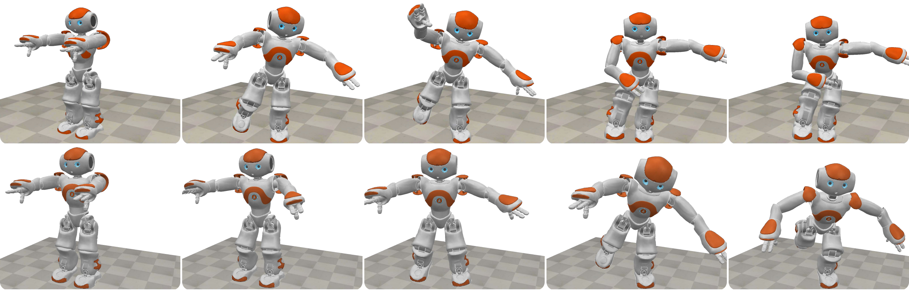
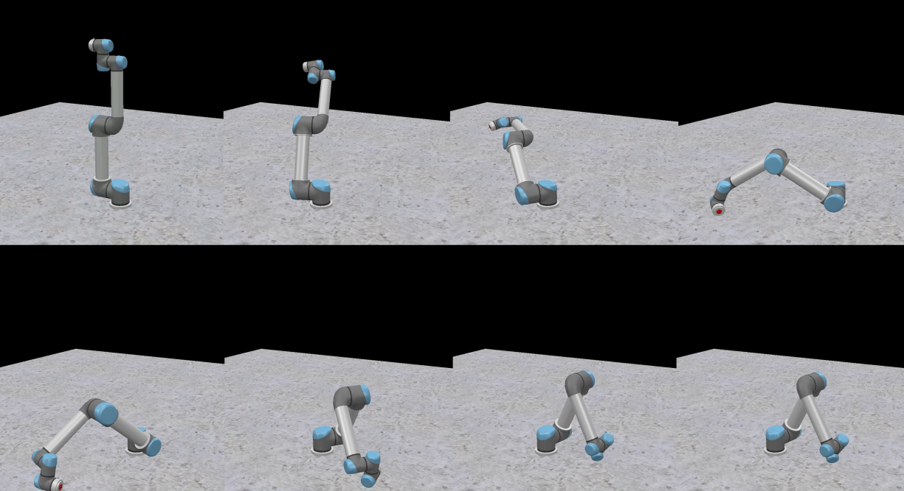

# NOCS – Numerical Optimal Control Scheme

**NOCS** is a lightweight and efficient C++ framework for solving constrained optimal control problems in robotics. It transcribes continuous-time control problems into nonlinear programs using a custom **Block Indexation Procedure (BIP)**, enabling fast and memory-efficient computation of optimal trajectories.

NOCS supports both **analytical** and **numerical** derivatives of robot dynamics, using libraries like **Pinocchio** and optionally **RBDL**. It is well-suited for robots with many degrees of freedom and has demonstrated competitive performance against frameworks like **CasADi**.


---

## 🚀 Features

- Block Indexation Procedure (BIP) for fast, sparse-free NLP transcription
- Analytical or numerical derivatives of dynamics
- Integration with Ipopt for nonlinear optimization
- Compatible with Pinocchio and optionally RBDL
- Minimal dependencies and CMake-based build

---

## 📦 Dependencies

Ensure the following dependencies are installed in `PREFIX=/usr/local/`:

- [Eigen 3.3.4](https://gitlab.com/libeigen/eigen/-/releases/3.3.4)
- [Ipopt](https://coin-or.github.io/Ipopt/INSTALL.html)
- [Pinocchio](https://github.com/stack-of-tasks/pinocchio)
- [RBDL (optional)](https://rbdl.github.io/)

---

## 🛠️ Installation

Clone and build the project with CMake:

```bash
git clone https://github.com/yourusername/NOCS.git
cd NOCS
mkdir build && cd build
cmake -DDYNLIBRARY=pinocchio ..    # or use -DDYNLIBRARY=rbdl
make -j$(nproc)                    # Use -jN to parallelize
```

## 📚 Citing This Work

If you use **NOCS** in your research, please cite the following paper:

```bibtex
@article{yourcite,
  title     = {Trajectory optimization for highly articulated robots based on sparsity-free local direct collocation},
  author    = {Daniel Carodna-Ortiz, Gustavo Arechavaleta},
  journal   = {Journal/Conference Name},
  year      = {2025},
  note      = {Available at https://github.com/daniel-cardona/NOCS}
}
```


